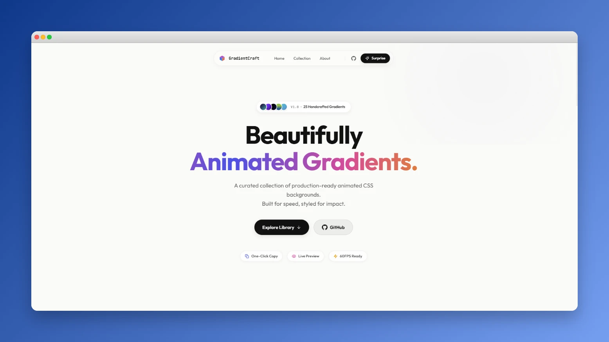
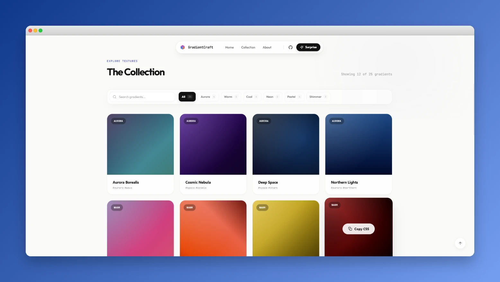
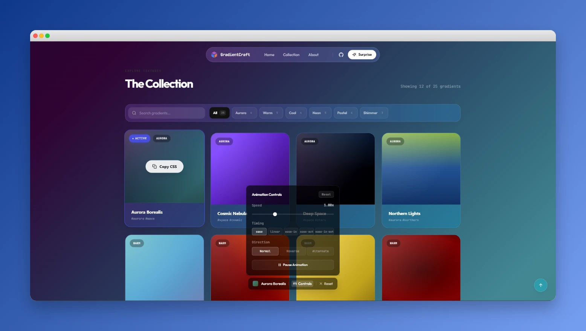

# GradientCraft — Animated CSS Backgrounds for the Modern Web

> **Live site → [gradientcraft.fun](https://gradientcraft.fun)**

A curated collection of **production-ready animated CSS backgrounds** you can drop into any project in seconds. Browse, preview full-page, tune the animation live, and copy the complete CSS + `@keyframes` in one click.

### 🎥 Video Demo

<p align="center">
  <video src="public/gradient-craft.mp4" width="100%" controls autoplay loop muted></video>
</p>

<p align="center">
  
</p>

<p align="center">
  
  
</p>

---

## What makes this different from pattern libraries?

Tools like PatternCraft give you static CSS patterns (grids, dots, stripes). GradientCraft is focused entirely on **animated** backgrounds — every gradient is alive, breathing, and running at 60FPS using pure CSS keyframes with zero JavaScript on the animation thread.

| Feature | GradientCraft | Static Pattern Libraries |
|---|---|---|
| Animated backgrounds | ✅ | ❌ |
| Full-page live preview | ✅ | ❌ |
| Real-time animation controls | ✅ | ❌ |
| Zero JS runtime overhead | ✅ | ✅ |
| One-click CSS copy | ✅ | ✅ |

---

## ✨ Features

- **Zero JS Runtime** — Every animation runs on pure CSS keyframes. No libraries, no main-thread blocking, consistent 60FPS.
- **Full-Page Preview** — Click any gradient to apply it as your page background and experience it at full scale.
- **Real-Time Controls** — Adjust speed, direction (normal / reverse / alternate), timing function, and pause — all live before you copy.
- **One-Click Copy** — Copies the complete `background`, `animation`, and `@keyframes` CSS. Works in React, Next.js, Vue, or plain HTML.
- **6 Curated Categories** — Aurora, Warm, Cool, Neon, Pastel, and Shimmer.
- **Surprise Me** — Instantly jumps to a random gradient for quick inspiration.
- **Ultra Responsive** — Fully optimized from mobile to ultrawide.

---

## 🛠️ Tech Stack

| | |
|---|---|
| Framework | [Next.js 16 (App Router)](https://nextjs.org/) |
| Library | [React 19](https://react.dev/) |
| Styling | [Tailwind CSS 4](https://tailwindcss.com/) |
| Runtime | [Bun](https://bun.sh/) |
| Language | TypeScript (strict) |

---

## 🚀 Getting Started

Requires [Bun](https://bun.sh/) installed on your machine.

```bash
# Clone
git clone https://github.com/Nandhu125/gradient-craft.git
cd gradient-craft

# Install
bun install

# Dev server
bun dev
```

Open [http://localhost:3000](http://localhost:3000).

```bash
# Production build
bun run build
bun start
```

---

## 📂 Project Structure

```
src/
├── app/           # Next.js App Router, global styles
├── components/
│   ├── gradients/ # GradientCard, GradientCollection, AnimationControls, GradientBackground
│   ├── home/      # Hero, About sections
│   ├── layout/    # Navbar, Footer
│   └── ui/        # Logo, Icons, shared primitives
├── data/
│   └── gradients.ts  # All gradient definitions (CSS + keyframes registry)
└── types/         # TypeScript interfaces
```

---

## 🤝 Contributing

Got a beautiful animated gradient to share? PRs are welcome.

1. Fork the repo
2. Create a branch: `git checkout -b feature/YourGradientName`
3. Add your gradient to `src/data/gradients.ts` following the existing schema
4. Open a Pull Request

---

## 📄 License

MIT — free to use in personal and commercial projects. See [`LICENSE`](LICENSE).

---

<p align="center">Handcrafted with ❤️ for the creative web · <a href="https://gradientcraft.fun">gradientcraft.fun</a></p>
