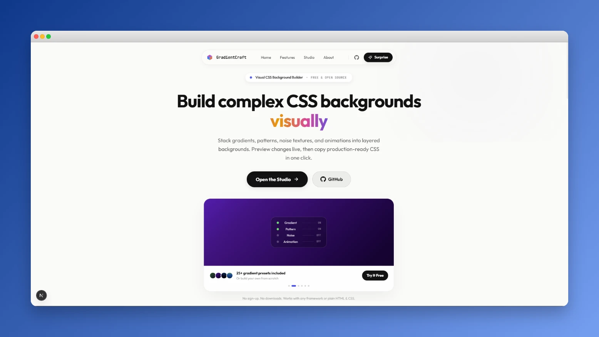
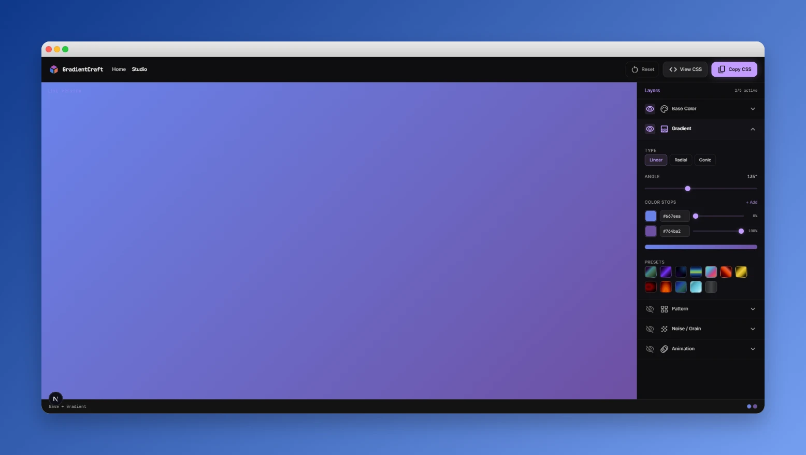
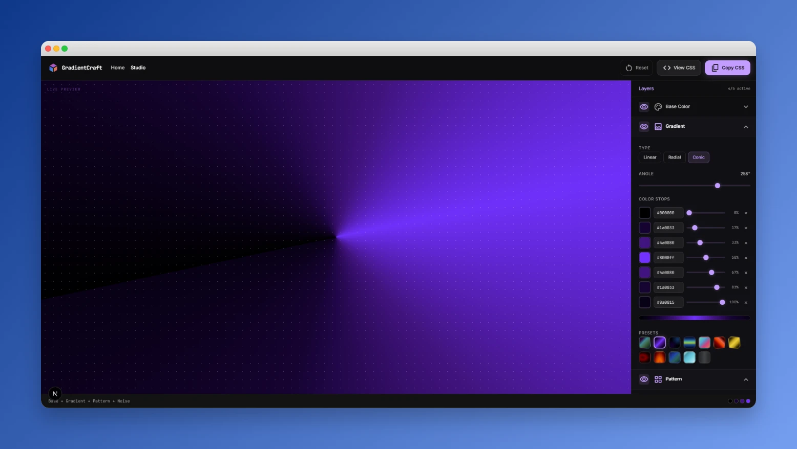

# GradientCraft — CSS Background Studio

> **Live site → [gradientcraft.fun](https://gradientcraft.fun)**

A visual **CSS background composer** that lets you stack gradients, patterns, noise textures, and animations into layered backgrounds. Preview changes live, then copy production-ready CSS in one click.

### Video Demo

<p align="center">
  <video src="public/gradient-craft.mp4" width="100%" controls autoplay loop muted></video>
</p>

<p align="center">
  
</p>

<p align="center">
  
  
</p>

---

## What is this?

Most CSS background tools only handle one thing — a gradient picker, a pattern generator, or a noise tool. GradientCraft Studio combines all of them into a single layered compositor. You toggle layers on/off, adjust their properties with sliders, and the studio generates one clean CSS block that stacks everything together.

| Feature | GradientCraft Studio | Single-purpose tools |
|---|---|---|
| Layered background composing | Yes | No |
| Gradient + Pattern + Noise + Animation | Yes | One at a time |
| Live preview | Yes | Varies |
| One-click CSS export | Yes | Yes |
| Zero JS in output | Yes | Yes |

---

## Features

**5 composable layers** — each toggleable independently:

- **Base Color** — Solid background color with hex input and preset swatches
- **Gradient** — Linear, radial, or conic with custom angles, 2-6 color stops, and 25+ presets
- **Pattern** — Dots, grids, lines, diagonals, checkerboards, crosses — adjustable size, color, and opacity
- **Noise / Grain** — SVG-based feTurbulence noise with intensity and opacity controls
- **Animation** — GPU-powered CSS keyframe animations with speed (0.25x-3x) and direction control

**Studio UX:**

- Accordion-based right sidebar — all layers visible, expand to edit, visibility toggle on each header
- Live preview takes up the main canvas area
- One-click Copy CSS generates stacked `background-image`, `background-size`, `background-color`, `animation`, and `@keyframes`
- Output is pure CSS — no JavaScript, no dependencies, works anywhere

---

## Tech Stack

| | |
|---|---|
| Framework | [Next.js 16 (App Router)](https://nextjs.org/) |
| Library | [React 19](https://react.dev/) |
| Styling | [Tailwind CSS 4](https://tailwindcss.com/) |
| Runtime | [Bun](https://bun.sh/) |
| Language | TypeScript (strict) |

---

## Getting Started

Requires [Bun](https://bun.sh/) installed on your machine.

```bash
# Clone
git clone https://github.com/Nandhu125/gradient-craft.git
cd gradient-craft

# Install
bun install

# Dev server
bun dev
```

Open [http://localhost:3000](http://localhost:3000) for the landing page, or go directly to [http://localhost:3000/studio](http://localhost:3000/studio) for the editor.

```bash
# Production build
bun run build
bun start
```

---

## Project Structure

```
src/
├── app/
│   ├── page.tsx           # Landing page (studio marketing)
│   └── studio/page.tsx    # Studio editor (main tool)
├── components/
│   ├── studio/            # Preview panel, controls panel, layer controls
│   │   └── layers/        # Base, gradient, pattern, noise, animation controls
│   ├── home/              # Hero, HowItWorks, Features, About sections
│   ├── layout/            # Navbar, Footer
│   └── ui/                # Logo, Icons, shared primitives
├── data/
│   └── gradients.ts       # Gradient presets + keyframes registry
├── lib/
│   └── studio-css.ts      # CSS generation: generateCSS(), computePreviewStyle()
└── types/
    └── studio.ts          # StudioState, layer interfaces, defaults
```

---

## How the CSS generation works

The studio maintains a `StudioState` object with 5 layer configs. Two pure functions handle output:

- `computePreviewStyle(state)` — returns a `CSSProperties` object for the live preview
- `generateCSS(state)` — returns a formatted CSS string for copy/export

Layers stack as a `background-image` array: noise (top) → pattern → gradient (bottom), with matching `background-size` values. Noise uses an inline SVG data URI with `feTurbulence`. Animations reference keyframes from the preset library.

---

## Contributing

PRs are welcome — whether it's new gradient presets, pattern types, or UX improvements.

1. Fork the repo
2. Create a branch: `git checkout -b feature/your-feature`
3. Make your changes
4. Open a Pull Request

---

## License

MIT — free to use in personal and commercial projects. See [`LICENSE`](LICENSE).

---

<p align="center">Built by <a href="https://github.com/Nandhu125">Nandhu</a> · <a href="https://gradientcraft.fun">gradientcraft.fun</a></p>
